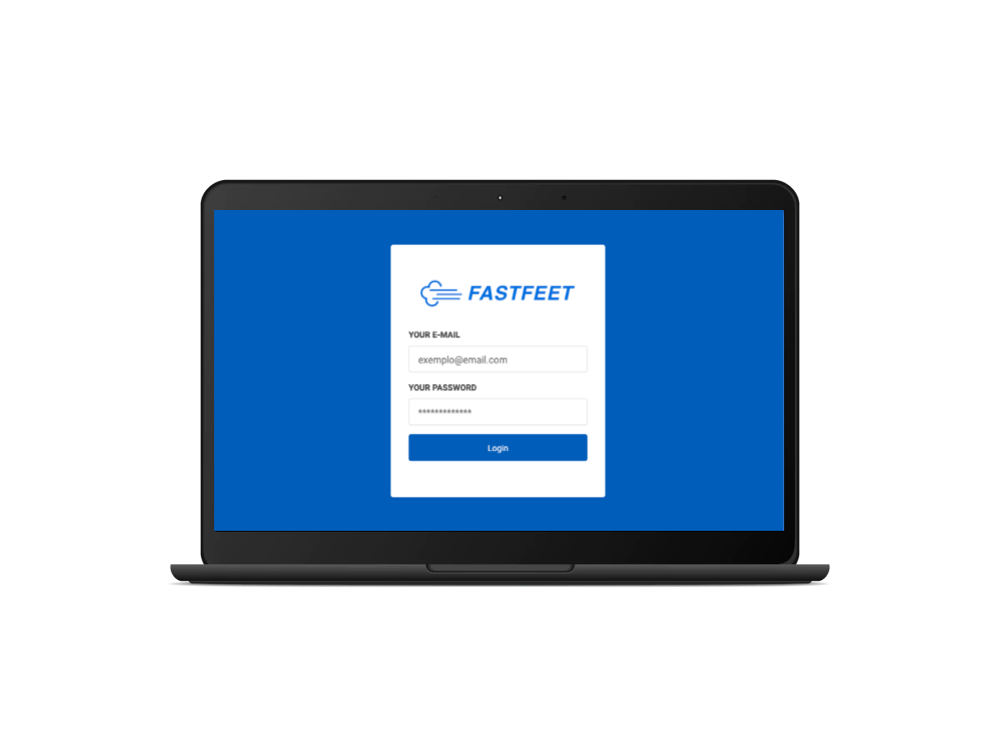
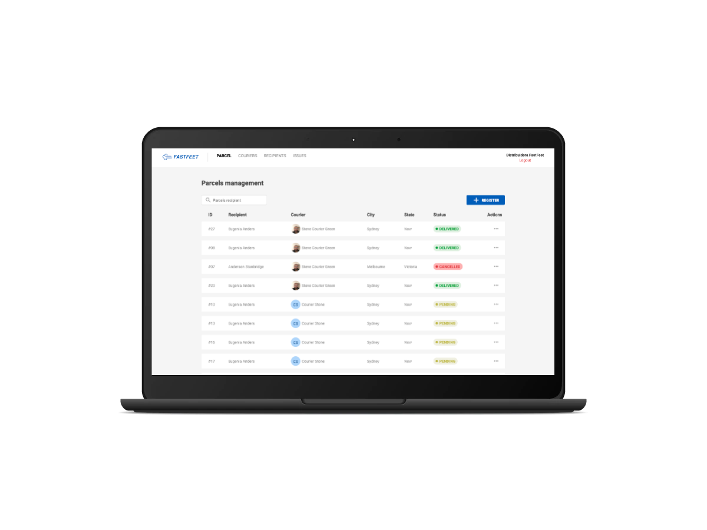

<h1 align="center">
  
</h1>

<p align="center">
  

  <a href="https://github.com/diazevedo">
    
  </a>

  
</p>

<h2 align="center">
  
  
</h2>

### Description

This is the backend code of a project developed as the final challenge from [Rockeseat Bootcamp](https://rocketseat.com.br/gostack). This the frontend version of the app.
The app web version allows administrators to manage parcels, couriers, recipients, and check any delivery problems.

### Running the project

This project consumes the [API](https://www.github/diazevedo.com/fast-feet) so you need that running.

```bash
# Open a terminal
# Run the below command to install dependenciess
yarn

# To run the application
yarn start
```

Use this user:

```bash
E-mail: admin@fastfeet.com
Password: 123456
```
